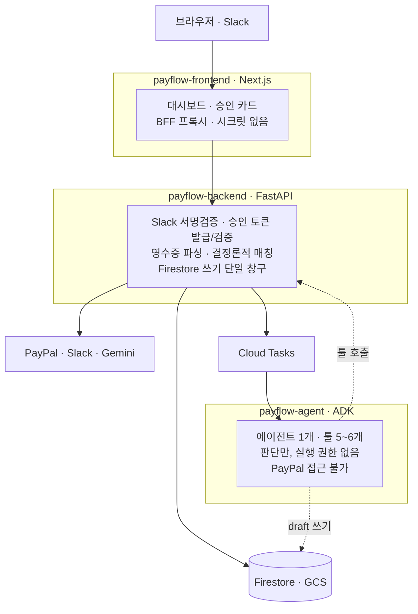
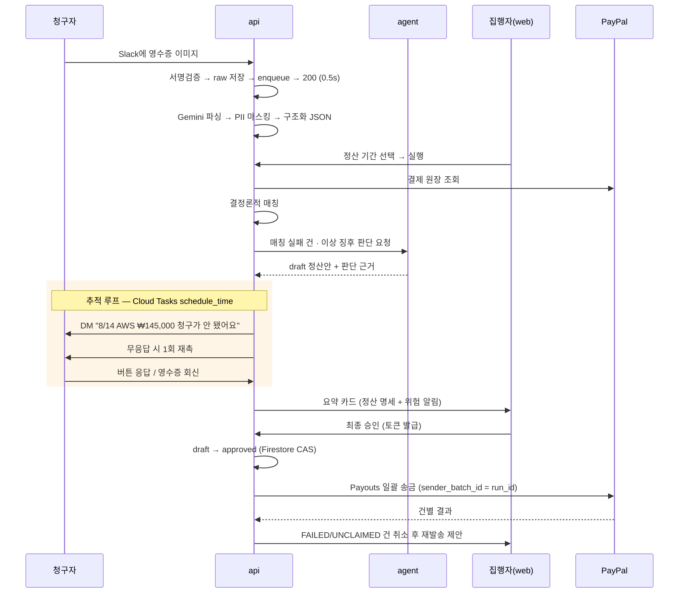

# PayFlow

**영수증 한 장부터 송금 완료까지, 공금 정산을 대신 처리하는 AI 에이전트**

소규모 팀의 비용 정산 — 영수증 수집, 청구 항목 생성, 결제 원장 대조, 이상 탐지, 일괄 송금, 세무 리포트 — 을 하나의 워크플로로 묶는다. 사람은 **최종 승인 버튼 하나만** 누른다.

> 상태: 구현 착수 전 · 마감 **2026-09-01 09:00 KST**
> 이 문서는 제품 개요다. 개발 규칙은 [`CLAUDE.md`](CLAUDE.md)와 [`rules/`](rules/)가 우선한다.

## 문제

5~20인 스타트업, 개인사업자, 프로젝트 팀 — 공금을 관리하는 소규모 그룹이 매달 반복하는 일:

- 법인카드 한도가 부족해 개인 카드로 선결제하고 수기로 정산을 요청한다
- 영수증은 Slack에, 인보이스는 이메일에, 원장은 PayPal에 흩어져 있다
- 정산 대상이 10명이면 송금을 10번 한다
- 지난달과 같은 인보이스가 또 올라와도 사람이 눈으로 잡아야 한다
- 청구자는 10건을 올렸는데 8건만 입금된다. 무엇이 왜 빠졌는지 알 방법이 없다

## 설계 원칙 3개

1. **에이전트는 돈에 접근하지 않는다.** 코드가 아니라 IAM으로 막혀 있다. 에이전트가 하는 일은 정산안 문서를 쓰는 것이지 돈을 보내는 것이 아니다.
2. **승인 토큰 없이 송금 엔드포인트는 실행되지 않는다.** 토큰은 LLM 컨텍스트에 들어가지 않는다.
3. **금액 계산은 LLM이 하지 않는다.** LLM은 판단 근거를 서술하고, 숫자는 코드가 만든다.

## 아키텍처

**단방향이다.** `web → api → agent`. 역방향 동기 호출은 없다. 에이전트가 결과를 돌려주는 경로는 Firestore 쓰기와 Cloud Tasks 콜백뿐이고, Slack 메시지 발송도 `api`가 한다.

이유는 검열 지점을 한 곳에 두기 위해서다. 프롬프트 인젝션된 영수증이 Slack DM으로 새어나가는 걸 막는 게 이 규칙이다. 상세는 [`rules/architecture.md`](rules/architecture.md).

### 코드가 하는 일 / 에이전트가 하는 일

범위를 좁히는 게 정확도를 올린다.

| 일 | 담당 |
| --- | --- |
| 영수증 이미지 → JSON | `api`의 Gemini 단발 호출 (ADK 아님) |
| 원장 ↔ 영수증 매칭 | 결정론적 코드 (금액 · 날짜 윈도우 · 가맹점명) |
| 금액 합산, 인당 분배 | 코드 |
| 매칭 실패 건 판단 | 에이전트 |
| 이상 징후 설명 서술 | 에이전트 |
| 재요청 문안 작성 | 에이전트 |

매칭을 LLM에 넘기지 않는 이유는 데모에서 흔들리면 전체 시연이 무너지는 유일한 지점이기 때문이다.

## 정산 플로우

**대기는 에이전트 세션을 재우지 않는다.** Firestore 상태 머신이다 — `claim_request.status: PENDING → REMINDED → RESPONDED | EXPIRED`. 예약된 태스크가 깨어나 현재 상태를 읽고 분기하므로 중복 실행돼도 안전하다.

### 재요청 루프

| 상황 | 동작 |
| --- | --- |
| 파싱 실패 | 청구자에게 재업로드 요청 |
| 청구 내용이 영수증과 어긋남 | 청구자에게 정정 요청 |
| 결제 기록은 있는데 청구가 없음 | DM → 무응답 시 1회 재촉 |
| 기간 내 끝내 미제출 | 정산 대상에서 제외, 오프라인 처리 |

## 기술 스택

| 레포 | 런타임 | 배포 | 시크릿 |
| --- | --- | --- | --- |
| `payflow-frontend` | Next.js / TS | Cloud Run | 없음 |
| `payflow-backend` | FastAPI / Python | Cloud Run | PayPal, Slack |
| `payflow-agent` | ADK / Python | Cloud Run | 없음 (Vertex는 ADC) |
| `docs` | — | — | — |

**Gemini 3.5+** (해커톤 필수 요건, 모델 ID는 환경변수) · Vertex AI 경유 · Firestore · GCS · Cloud Tasks · Secret Manager

스키마 단일 소스는 `api`의 Pydantic 모델이다. `web`은 OpenAPI로 TS 타입을 생성하고, `agent`는 Python 패키지를 태그로 핀해 가져온다. 상세는 [`rules/schema-contract.md`](rules/schema-contract.md).

## 안전장치

| 항목 | 내용 |
| --- | --- |
| 승인 게이트 | `draft → approved` 전이는 Firestore 트랜잭션 CAS. 승인 토큰은 `run_id` + 금액 해시에 바인딩, 10분 만료, 승인 후 소각 |
| 멱등성 | `sender_batch_id = settlement_run_id`. 재시도해도 두 번 나가지 않는다 |
| 한도 | 배치 총액 · 건별 · 월간 누적 캡. 초과 시 에이전트에게 되묻지 않고 거부 후 사람에게 |
| 금액 표현 | 정수 minor unit + 통화. `float` 금지 |
| PII 마스킹 | Firestore 쓰기 **전에** 마스킹. 원본은 GCS에만 |
| 인젝션 방어 | 영수증 텍스트는 `<untrusted_receipt_text>` 블록으로 격리. 부수효과 툴은 `before_tool_callback` 통과 |
| 감사 로그 | `{ts, actor, action, run_id, before, after, reason}`. `reason`은 LLM 원문 그대로 |

**취소 가능 범위:** PayPal Payouts는 `UNCLAIMED` 상태에서만 취소된다. 수취인이 이미 수령한 건은 API로 회수할 수 없다. 상세는 [`rules/money-safety.md`](rules/money-safety.md).

## MVP 범위

**Must-Have** — 검증은 기능 순서가 아니라 리스크 순서로 뚫는다 ([`rules/workflow.md`](rules/workflow.md)).

- [ ] PayPal 샌드박스 payout 성공 + 동일 `sender_batch_id` 재시도 무해
- [ ] 승인 토큰 없이 `/payouts` 호출 → 403 (데모 5초 장면)
- [ ] Slack 서명검증 → enqueue → 3초 내 ack
- [ ] 영수증 이미지 → 구조화 JSON → Firestore
- [ ] 결정론적 매칭 + 에이전트 이상탐지 → draft
- [ ] 재촉 루프 E2E (`REMINDER_DELAY_SECONDS=20`)
- [ ] Cloud Run 배포 + IAM 분리 콘솔 확인
- [ ] 세무사 전달용 XLSX 출력

**Won't-Have** — Google Drive 자동 수집, 청구자용 별도 웹페이지, 계약서 단가 대조, 사업자등록번호 추출, 부가세 공제 판단, 타임시트 분석, Notion 연동, 5년 아카이빙, SaaS 미사용 탐지, 멀티 에이전트

## 데모

| 데이터 | 시연 목적 |
| --- | --- |
| 정상 프리랜서 인보이스 2건 | 기본 정산 플로우 |
| 고의 중복 인보이스 1건 | 이상 탐지 |
| 영수증과 청구 금액이 어긋나는 건 1건 | 에이전트 판단 |
| PayPal 결제는 있으나 영수증 미제출 1건 | 추적 루프 |
| 미등록 이메일 수취인 1명 | `UNCLAIMED` → 취소 → 재발송 |
| 프롬프트 인젝션이 적힌 영수증 1건 | 가드레일 |

**시간 압축은 가짜 시계를 만들지 않는다.** `REMINDER_DELAY_SECONDS` 환경변수 하나로 데모(20초)와 실제(86400초)를 전환하고, 동일 코드가 실제 값으로 GCP에서 돈 로그를 병행 제시한다.

## 레포 · 문서

`docs`는 각 코드 레포에 submodule로 붙는다. 각 레포 루트 `CLAUDE.md`는 얇게 두고 여기 `rules/`를 참조한다.

- [`CLAUDE.md`](CLAUDE.md) — 공통 규칙, 절대 규칙 3개
- [`rules/architecture.md`](rules/architecture.md) — 서비스 책임, 호출 방향, 신뢰 경계
- [`rules/money-safety.md`](rules/money-safety.md) — 멱등성, 승인 게이트, 금액 표현
- [`rules/schema-contract.md`](rules/schema-contract.md) — 폴리레포 스키마 동기화
- [`rules/agent-tools.md`](rules/agent-tools.md) — ADK 툴 작성 규칙
- [`rules/workflow.md`](rules/workflow.md) — 커밋, 크로스레포 변경 순서
- [`about_hackathon.md`](about_hackathon.md) — 해커톤 규정 · 심사 기준
- [`journal/`](journal/) · [`SUMMARY.md`](SUMMARY.md) — 작업 기록

## 미결

| 항목 | 내용 |
| --- | --- |
| 카테고리 선택 | Taskmaster / Collaborative Partner / Fortified Enterprise Fleet 중 하나. Taskmaster가 유력 |
| 제출용 영문 README | Spin-up instructions + Architecture Diagram 필수. 어느 레포에 둘지 미정 |
| PayPal MCP Server | 공식 MCP Server를 쓸지 Payouts API 직접 호출할지 |
| 통화 처리 | 원화 청구와 PayPal 송금 통화가 다를 때 환율 기준 시점 |
| 업무용/개인용 오판 | 에이전트가 개인 지출을 업무용으로 분류했을 때 걸러내는 단계 |
