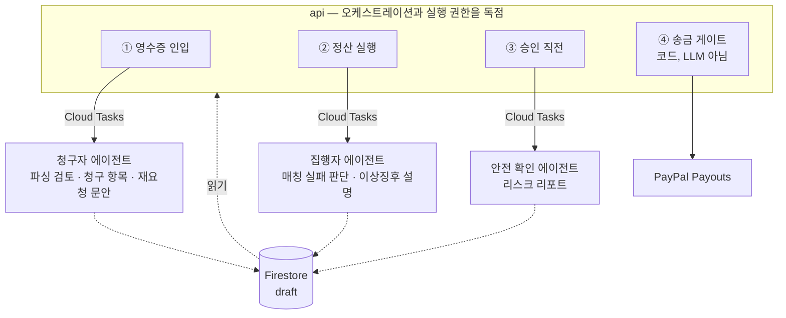

# 구현 계획

3인 병렬 작업 계획. 마감 **2026-09-01 09:00 KST**, 작성 시점 2026-08-16 기준 **16일**.

전제: 풀타임 3인. 담당자 배정은 트랙 라벨(A/B/C)로 두고 팀이 채운다.

| 트랙 | 담당 | 한 줄 요약 |
|---|---|---|
| **A** | | 청구자 경험 — Slack 인입부터 청구 항목 확정까지 |
| **B** | | 집행자 경험 — 매칭부터 대시보드 승인 카드까지 |
| **C** | | 돈과 안전 — 토큰·게이트·송금·인프라 |

## 선행 결정: 에이전트 3개

에이전트를 **청구자용 / 집행자용 / 안전 확인** 3개로 나눈다. 트랙 경계와 1:1로 맞아
각자 자기 에이전트를 끝까지 소유한다.

### 규칙 변경이 먼저다

현재 문서는 에이전트 1개를 전제한다. **D1에 아래를 고치지 않으면 문서와 코드가 어긋난다.**

| 파일 | 현재 | 변경 |
|---|---|---|
| `rules/architecture.md:83` | 하지 말 것 — "멀티 에이전트" | 삭제. 대신 "에이전트 간 직접 호출 금지" 추가 |
| `rules/agent-tools.md:19` | "ADK 에이전트 하나. 툴 대여섯 개." | 에이전트 3개, 각 툴 2~4개 |
| `README.md` 아키텍처 | "에이전트 1개 · 툴 5~6개" | 3개 구조로 |
| `payflow-agent/CLAUDE.md` | 하지 말 것 — "멀티 에이전트" | 삭제 |

**변경하지 않는 것:** `CLAUDE.md`의 절대 규칙 3개와 `money-safety.md` 전체.
에이전트를 늘리는 것과 돈 규칙을 푸는 것은 별개다.

### 구조



**에이전트끼리 직접 부르지 않는다.** 셋 다 `api`가 파이프라인 단계마다 Cloud Tasks로
호출하고, 결과는 Firestore draft로만 돌려준다. 에이전트 간 프로토콜을 만들지 않는 게
통합 비용을 막는 유일한 방법이다. 기존 단방향 원칙(`web → api → agent`)은 그대로다.

### 안전 확인 에이전트는 게이트가 아니다

**반드시 지킨다.** 이 에이전트는 리스크를 *서술*할 뿐이고, 실제 차단은 코드가 한다.

| | 담당 |
|---|---|
| 한도 초과 차단, 토큰 검증, CAS 전이, 중복 실행 차단 | **코드** (`api/src/guards/`) |
| "이 건이 지난달과 유사하다", "수취인 이메일이 계약서와 다르다" 서술 | 에이전트 |

LLM을 게이트로 쓰면 프롬프트 인젝션된 영수증이 승인을 통과시킬 수 있다.
에이전트 출력이 비어 있거나 틀려도 코드 게이트는 독립적으로 동작해야 한다.

## 병렬화 전략

### 문제

`schema-contract.md`는 `api`의 Pydantic을 단일 소스로 두고 변경 순서를 `api → agent → web`
으로 고정한다. 그대로 따르면 B와 A는 C가 스키마를 낼 때까지 아무것도 못 한다.

### 해결: 계약 우선 + 스텁

**D1에 스키마부터 확정하고, 구현 없이 태그를 끊는다.**

```
D1 오전  세 명이 함께 스키마 초안 작성 (구현 0줄)
D1 오후  api v0.1.0 태그 → OpenAPI 생성
         ├─ web: npx openapi-typescript → 타입 확보
         └─ agent: 의존성 핀 → import 가능
D2       api 스텁 엔드포인트 배포 (fixture 반환, 로직 없음)
D3~      세 트랙 완전 병렬
```

스텁이 배포되는 순간 병목이 사라진다. B는 실제 매칭 없이도 대시보드를 끝까지 만들고,
A는 실제 PayPal 없이도 청구 흐름을 만든다.

**fixture는 데모 데이터셋과 같은 것을 쓴다.** 따로 만들면 두 번 만든다.

### 디렉터리 소유권

세 트랙 모두 `payflow-backend`를 건드리므로 미리 가른다. 남의 디렉터리는 수정하지 않고 요청한다.

| 경로 | 소유 |
|---|---|
| `api/src/schemas/` | **공유** — 변경 시 `schema:` 커밋 + 태그 + 전원 통보 |
| `api/src/ingest/`, `api/src/parsing/` | A |
| `api/src/matching/`, `api/src/settlements/` | B |
| `api/src/guards/`, `api/src/payouts/`, `api/infra/` | C |
| `api/tests/fixtures/` | **공유** — 추가만, 수정 금지 |
| `agent/claimant/` | A |
| `agent/executor/` | B |
| `agent/safety/` | C |
| `web/` 전체 | B |

`api/src/payouts/`와 `api/src/guards/`는 `workflow.md`의 브랜치 게이트 대상이다.
main 직푸시 금지, 다른 사람이 한 번 본다.

## 일정

### Phase 0 — 계약 (D1, 8/16)

전원 함께. 이날 끝나지 않으면 이후 전부 밀린다.

- [ ] 규칙 변경 4건 반영 (위 표)
- [ ] Firestore 컬렉션 및 상태 머신 확정
- [ ] Pydantic 스키마 초안 → `api` v0.1.0 태그
- [ ] GCP 프로젝트, Firestore, Cloud Tasks 큐, Secret Manager 생성
- [ ] PayPal Sandbox 계정 (비즈니스 1 + 수신 3), Slack 워크스페이스 및 앱
- [ ] 데모 데이터셋 6종 확정 → `api/tests/fixtures/`
- [ ] 해커톤 카테고리 선택 (Taskmaster 유력)

### Phase 1 — 리스크 관통 (D2~D4, 8/17~19)

`workflow.md` 검증 순서를 따른다. **기능이 아니라 리스크가 큰 순서다.**

| 순위 | 항목 | 트랙 | 기한 |
|---|---|---|---|
| 1 | PayPal 샌드박스 payout 성공 + 동일 `sender_batch_id` 재시도 무해 | C | D2 |
| 2 | 승인 토큰 없이 `/payouts` → 403 | C | D2 |
| 3 | Slack 서명검증 → enqueue → 3초 내 ack | A | D3 |
| 4 | 영수증 이미지 → 구조화 JSON → Firestore | A | D4 |
| 5 | api 스텁 배포 (B·A 언블록) | C | D2 |

1·2번을 D2에 끝낸다. 1번은 유일한 외부 의존성이고, 2번은 구현 30분에 발표 임팩트가 가장 크다.

### Phase 2 — 기능 구현 (D5~D9, 8/20~24)

세 트랙 완전 병렬. 상세는 아래 트랙별 목록.

### Phase 3 — 통합 (D10~D12, 8/25~27)

- [ ] D10 스텁 → 실제 구현 교체, E2E 1회 성공
- [ ] D11 재촉 루프 E2E (`REMINDER_DELAY_SECONDS=20`)
- [ ] D11 실제 값(86400)으로 GCP 실행 로그 확보 — **영상용, 미루면 못 찍는다**
- [ ] D12 Cloud Run 3서비스 배포, IAM 분리 콘솔 확인

### Phase 4 — 제출물 (D13~D14, 8/28~29)

- [ ] 영문 README + Spin-up instructions
- [ ] Architecture Diagram
- [ ] 4분 데모 영상 촬영·편집 → YouTube **Public**
- [ ] Devpost 제출 폼, 팀원 전원 등록

### Phase 5 — 예비 (D15~D16, 8/30~31)

버퍼. 마감이 9/1 09:00이므로 **8/31에는 제출을 끝낸다.** 마감 당일 작업 금지.

## 트랙별 작업

### Track A — 청구자 경험

Slack에서 영수증이 들어와 청구 항목이 확정되기까지 전부.

**api**
- [ ] Slack webhook 수신 + 서명 검증 + 3초 내 ack
- [ ] raw 저장 → Cloud Tasks enqueue
- [ ] Gemini structured output 단발 호출로 영수증 → JSON (ADK 아님)
- [ ] PII 마스킹 — Firestore 쓰기 **전에**. 원본은 GCS에만
- [ ] 청구 항목 생성 및 `claims` 쓰기
- [ ] 미청구 건 DM 발송 + 무응답 1회 재촉 (Cloud Tasks `schedule_time`)
- [ ] `claim_request.status: PENDING → REMINDED → RESPONDED | EXPIRED`
- [ ] 청구자 지급 결과 통지 — "10건 중 8건 지급, 2건 사유"

**청구자 에이전트**
- [ ] 파싱 결과가 영수증과 맞는지 검토, 어긋나면 재요청 판단
- [ ] 재요청 문안 작성 (파싱 실패 / 내용 불일치 / 미청구 추궁)
- [ ] 업무용·개인용 분류 판단
- [ ] 비신뢰 입력 격리 — `<untrusted_receipt_text>` 블록

**시연 책임:** 추적 루프 (DM → 재촉 → 버튼 응답)

### Track B — 집행자 경험

매칭부터 승인 카드까지. **web 전체를 소유한다.**

**api**
- [ ] 결정론적 매칭 — 금액 · 날짜 윈도우 · 가맹점명. **LLM 아님**
- [ ] PayPal 결제 원장 조회 및 스냅샷
- [ ] 정산 배치 생성 (`settlement_run_id`)
- [ ] 금액 합산·인당 분배 — 코드가 한다
- [ ] XLSX 출력 (세무사 전달용)

**집행자 에이전트**
- [ ] 매칭 실패한 애매한 건 판단
- [ ] 이상 징후 설명 서술 (중복 청구, 금액 불일치)
- [ ] 요약 카드 문안 작성

**web**
- [ ] 대시보드 — 정산 기간 선택, 실행 트리거
- [ ] 요약 카드 — 정산 명세 + 위험 알림 렌더
- [ ] 승인 카드 — HITL 진입점
- [ ] OpenAPI 타입 생성 파이프라인, 생성 파일 커밋
- [ ] 시크릿 없음. `NEXT_PUBLIC_`에 민감 정보 금지

**시연 책임:** 이상 탐지 → 요약 카드 → 승인 클릭

### Track C — 돈과 안전

돈이 나가는 경로 전부와 인프라. **브랜치 게이트 대상이 가장 많다.**

**api**
- [ ] 승인 토큰 발급/검증 — `run_id` + 금액 해시 바인딩, 10분 만료, 사용 후 소각
- [ ] `/payouts` 게이트 — 토큰 없으면 403
- [ ] 한도 캡 — 배치 총액 · 건별 · 월간 누적. 환경변수
- [ ] `draft → approved` CAS 전이 (Firestore 트랜잭션)
- [ ] `sender_batch_id = settlement_run_id` 멱등성
- [ ] PayPal Payouts 호출 — 승인 응답에서 동기 호출 금지, `executing` 마킹 후 Cloud Tasks
- [ ] 지급 결과 대조 → `FAILED`/`UNCLAIMED` 취소 후 재발송 제안
- [ ] 감사 로그 `{ts, actor, action, run_id, before, after, reason}`
- [ ] `before_tool_callback` — 한도 검사 · 중복 실행 검사 · 감사 로그

**안전 확인 에이전트**
- [ ] 승인 직전 리스크 리포트 작성 (조언, 게이트 아님)
- [ ] 판단 근거를 `audit_logs.reason`에 원문 그대로

**인프라**
- [ ] Terraform — Cloud Run 3, Firestore, Cloud Tasks, Secret Manager, IAM
- [ ] **`agent` 서비스 계정에 PayPal 시크릿 접근 권한 없음을 코드로 증명.** 주석 필수
- [ ] 스텁 엔드포인트 (D2, 나머지 둘 언블록)

**시연 책임:** 403 거부 5초 장면, IAM 분리 콘솔

## 동기화 지점

| | 시점 | 조건 | 못 지키면 |
|---|---|---|---|
| **S0** | D1 종료 | 스키마 v0.1.0 태그 | 전원 대기. 최우선 |
| **S1** | D2 종료 | 스텁 배포 + payout 성공 + 403 | A·B 블로킹 |
| **S2** | D9 종료 | 각 트랙 단독 동작 | 통합 3일로 부족 |
| **S3** | D12 종료 | E2E 성공 + Cloud Run 배포 | 영상 못 찍음 |
| **S4** | D14 종료 | 제출물 전량 | 마감 위험 |

매일 15분 스탠드업. 블로킹만 말한다.

## 커밋 · 동기화 규칙

- 각자 자기 트랙 디렉터리는 `main` 직푸시. 돈 경로만 브랜치 + 리뷰
- 스키마 변경은 `schema:` 커밋 + 본문에 영향 레포 명시 + 태그 + 전원 통보
- 변경 순서 `api → agent → web` 역순 금지
- `docs/` 규칙을 고치면 코드 레포 3개 submodule 포인터도 올린다
- 매일 `journal/YYYY-mm-dd.md` 기록

## 리스크

| 리스크 | 대응 |
|---|---|
| **에이전트 3개 통합 실패** | 에이전트 간 직접 호출을 원천 금지. 셋 다 `api`가 부르고 Firestore로만 답한다 |
| PayPal Sandbox 계정 문제 | D2에 최우선 관통. 막히면 즉시 전원 공유 |
| 스키마 변경 폭주 | D1에 넉넉히 잡고, D5 이후 변경은 전원 합의 |
| 영상 촬영 시간 부족 | D11에 실시계 로그를 미리 확보. 편집은 D14 |
| Gemini 파싱 불안정 | 데모 데이터셋 고정, fixture 폴백 경로 확보 |
| 한 트랙 지연 | S2(D9)에서 판단. 미완 기능은 Won't-Have로 내린다 |

## 미결

| 항목 | 필요 시점 |
|---|---|
| 담당자 3인 트랙 배정 | D1 |
| 해커톤 카테고리 | D1 |
| 계정과목 자동 매핑 포함 여부 | D1 (회의록에는 있으나 MVP 범위 미정) |
| 집행자 자연어 라우팅 포함 여부 | D1 (한도 설정 변경은 `money-safety.md`와 충돌 소지) |
| 영문 제출 README를 어느 레포에 둘지 | D13 |
| 통화 처리 — 환율 기준 시점 | D5 |
