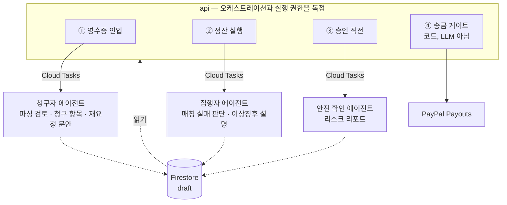

# 구현 계획

3인 병렬 작업 계획. 마감 **2026-09-01 09:00 KST**, 작성 시점 2026-08-16 기준 **16일**.

전제: 풀타임 3인.

| 트랙 | 담당 | 한 줄 요약 |
|---|---|---|
| **A** | 정유진 | 청구자 경험 — Slack 인입부터 청구 항목 확정까지 |
| **B** | 박수현 | 집행자 경험 — 매칭부터 대시보드 승인 카드까지 |
| **C** | 송재훈 | 돈과 안전 — 토큰·게이트·송금·인프라 |

## 진행 현황

<!-- 갱신: 2026-08-19 -->

| Phase | 상태 |
|---|---|
| **Phase 0** 계약 (D1) | ✅ **완료** — 담당 배정, 계정 3종, 스키마 계약, GCP 부트스트랩, OIDC 관통 |
| **Phase 1** 리스크 관통 (D2~D4) | 🟡 **진행 중** — 순위 0~4 관통. **남은 것은 순위 5(파싱)뿐** |
| **Phase 2** 기능 구현 (D5~D9) | ⬜ 대기 |
| **Phase 3** 통합 (D10~D12) | ⬜ 대기 |
| **Phase 4** 제출물 (D13~D14) | ⬜ 대기 |
| **Phase 5** 예비 (D15~D16) | ⬜ 대기 |

### ✅ 완료

**문서 기반**

- `README.md` 제품 개요, `rules/` 5종, `CLAUDE.md` 공통 + 레포별 3개
- `docs`를 코드 레포 3개에 submodule로 연결
- 8/15 회의록 `meetings/2026-08-15.md`에 아카이빙 + 현재 문서와의 대조 부록
- `plan.md`, `journal/`, `SUMMARY.md` 기록 체계

**규칙 갱신**

- 에이전트 3개 전제로 4곳 갱신 — `rules/architecture.md`, `rules/agent-tools.md`,
  `README.md`, `payflow-agent/CLAUDE.md`
- "멀티 에이전트 금지" → "에이전트끼리 직접 호출 금지"로 대체
- 마크다운 분량 제한을 `CLAUDE.md`에만 적용하도록 축소

**결정 8건** — 아래 [확정된 것](#확정된-것) 참조

**스키마 계약** — [`rules/schema-contract.md`](rules/schema-contract.md)에 확정본.
컬렉션 8종 · ID 체계 · 환율 · 계정과목 라우팅 · 승인 토큰 · 라우트 · 환경변수 · fixture 8종

**GCP 부트스트랩** — 프로젝트 `payflow-hackathon-2026`, API 4종 활성화,
Firestore Native(`asia-northeast3`), Terraform·uv 설치. 전 과정 `infra/gcp-bootstrap.sh`로 재현 가능

**담당 배정과 계정** — A 정유진 · B 박수현 · C 송재훈. GCP 결제 연결,
PayPal Sandbox, Slack 데모 워크스페이스 발급 완료

### 코드

| 레포 | 상태 |
|---|---|
| `payflow-backend` | 🟢 `guards/`·`payouts/` 전 경로 구현·배포 완료(승인 토큰·403 게이트·CAS·멱등성·PayPal 실호출·FX 환산·대조·감사 로그). `ingest/`는 Slack 인입 경로 구현 완료(서명 검증·`receipts` dedup 트랜잭션·파싱 enqueue, 테스트 38건). `settlements/`는 XLSX 출력만. `parsing/`·`matching/`은 여전히 빈 스캐폴딩(A·B 몫) |
| `payflow-frontend` | ⬜ 빈 상태 |
| `payflow-agent` | 🟡 `safety/`(LlmAgent + `submit_risk_report`)·`shared/` 구현 완료, 로컬 인증 게이트까지 검증. `claimant/`·`executor/`는 501 스텁. Dockerfile/CI 없어 미배포 |

별도 스캐폴딩 단계를 두지 않기로 했다. 각 트랙이 D1~D2에 자기 레포를 직접 세운다.

### 🔴 다음 액션

| # | 항목 | 누가 |
|---|---|---|
| 1 | ✅ Track A 델타 3건 — 전부 확정본에 반영 완료 (8/18). 남은 것은 `agent` 핀 갱신 → `web` 타입 재생성. **기준 태그가 v0.5.0까지 올라갔다**(v0.4.0 인입 필드 + v0.5.0 `receipt_dedup_keys`). `receipts.currency`가 nullable이 된 것은 B의 결정론적 매칭에 영향 | A·B |
| 2 | ✅ OpenAPI 생성 → fixture 반환 스텁 배포 (A·B 언블록) — 스텁을 넘어 `guards`·`payouts` 실제 구현까지 배포 완료 | C |
| 3 | B가 `openapi-typescript`, A가 스키마 import로 S0 완료 판정 (미확인 — A·B 진행분 확인 필요) | A·B |

**`sender_item_id` 길이 초과는 8/17에 해소됐다.** `settlement_run_id`를 축약형
(`run_{yymmdd}_{ULID 앞 12자}`, 23자)으로만 쓰기로 정해 `sender_item_id`가 54자(재발송
포함 57자)로 상한 63자 안에 들어온다. `rules/schema-contract.md` §2·§3에 반영, fixture
8종도 이 형식으로 갱신했다.

문서가 `api/src/...`로 쓰는 경로는 `payflow-backend` 레포 루트의 `src/...`다.
`api`는 디렉터리가 아니라 서비스 이름이다.

**Phase 0 착수 블로커는 전부 해소됐다.** 담당자 배정, GCP 결제 연결, 계정 3종,
`gcloud`·Terraform 설치, 스키마 계약 10항목, OIDC 관통까지 끝났다.

## 선행 결정: 에이전트 3개

에이전트를 **청구자용 / 집행자용 / 안전 확인** 3개로 나눈다. 트랙 경계와 1:1로 맞아
각자 자기 에이전트를 끝까지 소유한다.

규칙 반영은 끝났다 — `rules/architecture.md`, `rules/agent-tools.md`, `README.md`,
`payflow-agent/CLAUDE.md` 네 곳이 에이전트 3개 전제로 갱신되어 있다.

`CLAUDE.md`의 절대 규칙 3개와 `money-safety.md`는 그대로다. 에이전트를 늘리는 것과
돈 규칙을 푸는 것은 별개다.

### 구조



**에이전트끼리 직접 부르지 않는다.** 셋 다 `api`가 파이프라인 단계마다 Cloud Tasks로
호출하고, 결과는 Firestore draft로만 돌려준다. 에이전트 간 프로토콜을 만들지 않는 게
통합 비용을 막는 유일한 방법이다. 기존 단방향 원칙(`web → api → agent`)은 그대로다.

### 안전 확인 에이전트는 게이트가 아니다

**반드시 지킨다.** 이 에이전트는 리스크를 *서술*할 뿐이고, 실제 차단은 코드가 한다.

| | 담당 |
|---|---|
| 한도 초과 차단, 토큰 검증, CAS 전이, 중복 실행 차단 | **코드** (`api/src/guards/`) |
| "이 건이 지난달과 유사하다", "수취인 이메일이 계약서와 다르다" 서술 | 에이전트 |

LLM을 게이트로 쓰면 프롬프트 인젝션된 영수증이 승인을 통과시킬 수 있다.
에이전트 출력이 비어 있거나 틀려도 코드 게이트는 독립적으로 동작해야 한다.

## 병렬화 전략

### 문제

`schema-contract.md`는 `api`의 Pydantic을 단일 소스로 두고 변경 순서를 `api → agent → web`
으로 고정한다. 그대로 따르면 B와 A는 C가 스키마를 낼 때까지 아무것도 못 한다.

### 해결: 계약 우선 + 스텁

**D1에 스키마부터 확정하고, 구현 없이 태그를 끊는다.**

```
D1 오전  세 명이 함께 스키마 초안 작성 (구현 0줄)
D1 오후  api v0.1.0 태그 → OpenAPI 생성
         ├─ web: npx openapi-typescript → 타입 확보
         └─ agent: 의존성 핀 → import 가능
D2       api 스텁 엔드포인트 배포 (fixture 반환, 로직 없음)
D3~      세 트랙 완전 병렬
```

스텁이 배포되는 순간 병목이 사라진다. B는 실제 매칭 없이도 대시보드를 끝까지 만들고,
A는 실제 PayPal 없이도 청구 흐름을 만든다.

**fixture는 데모 데이터셋과 같은 것을 쓴다.** 따로 만들면 두 번 만든다.

### 디렉터리 소유권

세 트랙 모두 `payflow-backend`를 건드리므로 미리 가른다. 남의 디렉터리는 수정하지 않고 요청한다.

| 경로 | 소유 |
|---|---|
| `api/src/schemas/` | **공유** — 변경 시 `schema:` 커밋 + 태그 + 전원 통보 |
| `api/src/ingest/`, `api/src/parsing/` | A |
| `api/src/matching/`, `api/src/settlements/` | B |
| `api/src/guards/`, `api/src/payouts/`, `api/infra/` | C |
| `api/tests/fixtures/` | **공유** — 추가만, 수정 금지 |
| `agent/claimant/` | A |
| `agent/executor/` | B |
| `agent/safety/` | C |
| `web/` 전체 | B |

`api/src/payouts/`와 `api/src/guards/`는 `workflow.md`의 브랜치 게이트 대상이다.
main 직푸시 금지, 다른 사람이 한 번 본다.

## 일정

### Phase 0 — 계약 (D1, 8/16)

병렬 작업의 비용은 착수할 때가 아니라 **통합할 때** 청구된다. 세 명이 나흘간 각자 만든
걸 붙였는데 필드 이름이 다르면 그 나흘이 날아간다. 흩어지기 전에 두 관문을 통과한다.

```
✅ 계정 발급 — 외부 대기시간이 있어 제일 먼저 걸었다
├─ GCP 프로젝트 + 결제 연결 + API 활성화 (Vertex · Firestore · Tasks · Run)
├─ PayPal Sandbox 비즈니스 1 + 수신 가상계정 3
└─ Slack 데모 워크스페이스 + 앱 + 서명 시크릿

        ↓ 발급 기다리는 동안

✅ 전원 합의 — 코드 0줄
├─ 담당자 트랙 배정 (A 정유진 · B 박수현 · C 송재훈)
├─ Firestore 컬렉션 · 필드 · 상태 enum
├─ Pydantic 스키마
├─ API 라우트 목록 + 디렉터리 소유권
├─ 에이전트 3개 입출력 계약
└─ 데모 데이터셋 8종 = fixture

        ↓ ── S0 ──

C 단독 — 나머지 둘은 대기
├─ api v0.1.0 태그 → OpenAPI 생성
├─ 스텁 엔드포인트 배포 (fixture 반환)
└─ Cloud Tasks → Cloud Run OIDC 경로

        ↓ ── S1 ── 흩어진다
```

**계정 발급을 먼저 걸어둔다.** PayPal Sandbox와 Slack 앱은 설정에 시간이 걸리고 가끔 막힌다.
스키마 회의는 계정 없이도 되므로 발급을 백그라운드로 돌리며 회의를 진행한다.

Slack은 실제 팀 워크스페이스가 아니라 **데모용을 새로 판다.** 실 데이터가 섞이지 않고
프롬프트 인젝션 영수증을 마음대로 테스트할 수 있다.

#### 로컬 환경

확인된 것: Node 24.13, npm 11.6, Python 3.14.2, Docker 29.1.

| 항목 | 조치 |
|---|---|
| `gcloud` CLI **미설치** | C가 설치. D1 OIDC 관통의 선행 조건 |
| Terraform **미설치** | C가 설치 |
| Python **3.14** | 너무 최신이라 `google-adk`·FastAPI 생태계가 못 따라올 수 있다. **컨테이너와 로컬 모두 3.12 또는 3.13으로 핀한다.** 마지막 주에 "로컬은 되는데 배포가 안 된다"로 하루 날리는 전형적인 지점 |

별도 스캐폴딩 단계가 없으므로 **Python 버전과 베이스 이미지만 D1에 합의하고** 나머지
프로젝트 구성은 각 트랙이 자기 레포에서 직접 세운다.

#### 합의해야 할 계약

**10항목 전부 [`rules/schema-contract.md`](rules/schema-contract.md)에 확정본으로 들어갔다.**
아래는 무엇을 덮었는지 확인용 목록이고, 정의 자체는 확정본이 단일 소스다.

- [x] **Firestore 컬렉션 · 필드 · 상태 enum** — 컬렉션 8종. 상태값은 **전부 `UPPER_SNAKE`**,
      상태 필드 이름은 전 컬렉션 `status`
- [x] **ID 체계** — ULID 기반. `sender_batch_id = {run_id}`,
      `sender_item_id = {run_id}:{recipient_id}`.
      `settlement_run_id`는 축약형(`run_{yymmdd}_{ULID 앞 12자}`, 23자)만 쓴다 — 전체
      ULID면 `sender_item_id`가 70자로 PayPal 상한 63자를 넘는다 (8/17 해소,
      `journal/2026-08-16.md` 14번 → `journal/2026-08-17.md`)
- [x] **금액 표현 확인** — `{amount_minor: int, currency: str}`. 환율은 문자열 + `Decimal`,
      항목별 환산 후 합산
- [x] **타임스탬프** — UTC 저장, 표시만 KST. 예외는 `receipts.transaction_date`(`date`) 하나
- [x] **계정과목 enum** — 코드값 7종(`PAYMENT_FEE` … `UNCLASSIFIED`) + 표시명 매핑.
      분류는 결정론적 신호(1단계) → `llm_confidence`(2단계) 순서
- [x] **`SettlementFilter` 스키마** — `extra="forbid"`. 기간 기준은 `receipts.transaction_date`
- [x] **에이전트 3개 입출력** — `agent_drafts.payload` 최상위 키만 계약. 응답 본문은 무의미
- [x] **API 라우트 목록 + 디렉터리 소유권** — 공개 11개 + Cloud Tasks 전용 4개.
      URL 경로와 핸들러 소유가 다를 수 있다 (`/settlements/runs/{run_id}/approve` → C)
- [x] **환경변수 이름** — 확정본 §11이 `.env.example` 원본이다
- [x] **데모 데이터셋 8종** → `api/tests/fixtures/`. 스텁도 이걸 반환하고 최종 데모도 이걸 쓴다.
      따로 만들면 두 번 만든다

#### 완료 판정

"끝났다"를 느낌으로 정하지 않는다. 넷 다 통과해야 흩어진다.

| # | 확인 방법 | 통과 조건 |
|---|---|---|
| 1 | B가 `npx openapi-typescript` 실행 | 타입 파일 생성됨 |
| 2 | A·C가 agent 레포에서 스키마 import | 에러 없이 import |
| 3 | 세 명이 각자 스텁 엔드포인트 호출 | fixture JSON 반환 |
| 4 | Cloud Tasks에서 비공개 Cloud Run 호출 | 200 응답 |

하나라도 안 되면 그 사람만 막히는 게 아니라 전원이 막힌다.

### Phase 1 — 리스크 관통 (D2~D4, 8/17~19)

`workflow.md` 검증 순서를 따른다. **기능이 아니라 리스크가 큰 순서다.**

| 순위 | 항목 | 트랙 | 기한 | 상태 |
|---|---|---|---|---|
| 0 | **Cloud Tasks → 비공개 Cloud Run OIDC 호출 성공** | C | D1 | ✅ `payflow-api` + `payflow-queue`로 200 확인 |
| 1 | api 스텁 배포 (A·B 언블록) | C | D2 | ✅ 스텁을 넘어 `guards`·`payouts` 실제 구현까지 배포 |
| 2 | PayPal 샌드박스 payout 성공 + 동일 `sender_batch_id` 재시도 무해 | C | D2 | ✅ 재전송은 `400`으로 거부 |
| 3 | 승인 토큰 없이 `/payouts` → 403 | C | D2 | ✅ 403 게이트 구현·라이브 검증, `infra/iam-403-demo.md`에 캡처 |
| 4 | Slack 서명검증 → enqueue → 3초 내 ack | A | D3 | ✅ `POST /slack/events`. 지연 주입 실측 최악 2.02s / 예산 3s |
| 5 | 영수증 이미지 → 구조화 JSON + 계정과목 → Firestore | A | D4 | ⬜ |

0번이 안 풀리면 A의 재촉 루프와 파싱 파이프라인이 통째로 막힌다. **D1에 뚫렸다** —
IAM 바인딩 전파 지연으로 첫 태스크가 1분간 403을 반복한 것 외에는 걸림돌이 없었다.

2번에서 나온 것 하나 — PayPal은 동일 `sender_batch_id` 재전송을 "같은 배치로 200 재응답"이
아니라 **`400 SENDER_BATCH_ID already exists`로 거부**한다. `api/src/payouts/`는 이 에러를
실패가 아니라 "이미 실행됨" 신호로 읽고 배치 조회로 넘어가야 한다. 그냥 예외로 두면
재시도 경로에서 정상 건이 실패로 기록된다.

2·3번을 D2에 끝낸다. 2번은 유일한 외부 의존성이고, 3번은 구현 30분에 발표 임팩트가 가장 크다.

**흩어지기 전에 C가 2번을 뚫는 걸 보고 간다.** 여기서 막히면 계획 전체를 다시 짜야 한다.

### Phase 2 — 기능 구현 (D5~D9, 8/20~24)

세 트랙 완전 병렬. 상세는 아래 트랙별 목록.

### Phase 3 — 통합 (D10~D12, 8/25~27)

- [ ] D10 스텁 → 실제 구현 교체, E2E 1회 성공
- [ ] D11 재촉 루프 E2E (`REMINDER_DELAY_SECONDS=20`)
- [ ] D11 실제 값(86400)으로 GCP 실행 로그 확보 — **영상용, 미루면 못 찍는다**
- [ ] D12 Cloud Run 3서비스 배포, IAM 분리 콘솔 확인

### Phase 4 — 제출물 (D13~D14, 8/28~29)

- [ ] 영문 README + Spin-up instructions → **`payflow-backend`**
- [ ] Architecture Diagram
- [ ] 4분 데모 영상 촬영·편집 → YouTube **Public**
- [ ] Devpost 제출 폼, 팀원 전원 등록

### Phase 5 — 예비 (D15~D16, 8/30~31)

버퍼. 마감이 9/1 09:00이므로 **8/31에는 제출을 끝낸다.** 마감 당일 작업 금지.

## 트랙별 작업

### Track A — 청구자 경험

Slack에서 영수증이 들어와 청구 항목이 확정되기까지 전부.

**api**
- [x] Slack webhook 수신 + 서명 검증 + 3초 내 ack — `POST /slack/events`. v0 서명(raw body 기준, 5분 skew), 지연 주입 실측 최악 2.02s / 예산 3s
- [x] raw 저장 → Cloud Tasks enqueue — `receipts` 문서를 `RECEIVED`로 생성(`slack_file_id` dedup 트랜잭션) 후 `/tasks/parse-receipt` enqueue. **이미지 원본 GCS 업로드는 아직이다** — 파싱 단계로 미뤘다(`GCS_RECEIPTS_BUCKET` + `google-cloud-storage` 미도입)
- [x] Gemini structured output 단발 호출로 영수증 → JSON (ADK 아님)
- [x] **계정과목 1차 매핑** — 위 파싱 호출에 포함. 신뢰도 낮으면 `미분류`
- [x] PII 마스킹 — Firestore 쓰기 **전에**. 원본은 GCS에만
- [x] 청구 항목 생성 및 `claims` 쓰기
- [x] 청구자 에이전트 draft 반영 — `POST /tasks/apply-claimant-draft`(`api/src/ingest/`).
      `agent_drafts`(`"CLAIMANT:{receipt_id}"`)를 읽어 `needs_requery=true`면
      영수증 `PARSED → NEEDS_REQUERY` · claim `CONFIRMED → DRAFT` 강등 ·
      `claim_requests` 신규(`PENDING`)를 한 트랜잭션으로 반영. `IN_RUN`·`SETTLED`
      claim은 건드리지 않고 감사 로그만 남김. draft 읽기는 B의
      `store.get_agent_draft` 재사용
- [x] 미청구 건 DM 발송 + 무응답 1회 재촉 (Cloud Tasks `schedule_time`) —
      `POST /tasks/remind` 하나가 상태 기계를 돌며 자기를 재예약한다
      (`payouts/reconcile`과 같은 패턴, 계약 §10에 라우트 추가 없음). DM 본문은
      코드가 짓지 않고 `agent_drafts`의 `requery_message`를 그대로 보낸다 —
      문안이 없으면 발송하지 않고 `CLAIM_REQUEST_NO_MESSAGE` 감사 로그만.
      `receipts.slack_channel_id`·`slack_message_ts`가 둘 다 있으면 스레드 답글,
      아니면 `recipients.slack_user_id`로 DM 폴백
- [ ] `claim_request.status: PENDING → REMINDED → RESPONDED | EXPIRED` —
      `PENDING → REMINDED → EXPIRED`는 구현·fixture 05 종단 검증 완료.
      **`RESPONDED`는 `/slack/interactions`가 없어 도달 불가** — 지금은 모든
      요청이 만료된다. 다음 작업
- [ ] 청구자 지급 결과 통지 — "10건 중 8건 지급, 2건 사유"

**청구자 에이전트**
- [ ] 파싱 결과가 영수증과 맞는지 검토, 어긋나면 재요청 판단
- [ ] 재요청 문안 작성 (파싱 실패 / 내용 불일치 / 미청구 추궁)
- [ ] 업무용·개인용 분류 판단
- [ ] 비신뢰 입력 격리 — `<untrusted_receipt_text>` 블록

**시연 책임:** 추적 루프 (DM → 재촉 → 버튼 응답)

### Track B — 집행자 경험

매칭부터 승인 카드까지. **web 전체를 소유한다.**

**api**
- [x] 결정론적 매칭 — 중복 청구 판정(`src/matching/duplicates.py`). 금액 완전일치 ·
      날짜윈도우 · 정규화 가맹점명, union-find로 클러스터링. **LLM 아님.** 후보를 배치에서
      빼지 않는 advisory 판정 — 서술 주체(집행자 vs 안전 확인)는 ③/④ 배선에서 결정
- [x] `POST /settlements/runs`에서 후보 claim의 receipt마다 이미지↔파싱 결과 검증
      (`src/settlements/verification.py`) — 파싱과 별개인 Gemini 단발 호출(`google-genai`,
      A의 `parsing/gemini.py`와 같은 패턴), 요청 핸들러 안에서 동기 실행. 판정만 반환하고
      금액은 고치지 않는다. `verified_at` 캐싱, 실패 시 `VERIFICATION_FAILED` 전이 +
      `claim_requests` 생성. **실호출은 GCP 접근자가 `scripts/test_verification_call.py`로
      스모크 테스트 필요**
- ~~PayPal 결제 원장 조회 및 스냅샷~~ — 죽은 항목. 원래 구상(PayPal 원장 ↔ 청구
      대조)은 스키마 진화 과정에서 폐기됐다. 실제 매칭은 claim들끼리의 중복
      탐지(위 결정론적 매칭)로 대체됨
- [x] 정산 배치 생성 (`settlement_run_id`), `SettlementFilter` 적용 — `routes.py`가 함
- [x] 금액 합산·인당 분배 — 배치 생성 시점은 잠정치(0), 승인 시점에 C의
      `guards/routes.py._lock_fx_and_total`이 실제 계산
- [ ] 환율 **승인 시점 고정** — 정산 배치에 박아둔다. 승인 토큰이 금액 해시에 바인딩되므로
      승인 후 환율이 변하면 토큰이 깨진다
- [x] XLSX 출력 (세무사 전달용, **계정과목 컬럼 포함**)

**집행자 에이전트**
- [x] 매칭 실패한 애매한 건 판단 + 이상 징후 설명 서술 (`payflow-agent/executor/`).
      `find_duplicate_groups` 출력을 힌트로 주고 그 외 판단은 LLM이 한다.
- [x] 호출 배선 (`src/settlements/enqueue.py`) — `POST /settlements/runs`가 배치
      커밋 후 Cloud Tasks로 enqueue. A가 만들어둔 `enqueue_task(audience=...)`·
      `AGENT_SERVICE_URL` 그대로 재사용. **실호출은 GCP 접근자 확인 필요**(로컬
      샌드박스에서 Cloud Tasks→agent 라운드트립을 못 봤다)
- [x] `agent_drafts.EXECUTOR` 읽기 — `GET /settlements/runs/{run_id}`의
      `executor_analysis` 필드 (`store.get_agent_draft` 신설). `task_id`를
      `executor_draft_task_id`("EXECUTOR:{run_id}")로 네임스페이스해 안전 확인
      에이전트와의 잠재적 문서 충돌을 막음. `safety_report` 필드는 C의 배선·
      task_id 컨벤션 미정이라 보류
- [ ] **자연어 요청 → `SettlementFilter` 변환.** `settlement_run_id`가 아직 없는
      시점 호출이라 세션·draft 모델과 안 맞아 범위 분리 — `web` 입력 UX 확정 후 별도 설계
- [ ] `미분류` 계정과목 판단
- [x] 요약 카드 문안 작성 (`summary_text`, 이상징후 서술과 같은 호출)

**web** — 구현 완료 (`payflow-frontend/plans/2026-08-21-web-dashboard.md` Task 0~6)
- [x] Task 0 — OpenAPI 타입 생성. 계획과 달리 GCP 접근 없이 `app.openapi()`로
      가능했다. 다만 settlements 라우트에 `response_model`이 없어 실제 타입은
      대부분 `unknown` — `src/types/settlement.ts`에 손으로 옮김(백엔드가
      `response_model`을 붙이면 정리 대상, 별도 과제로 남음)
- [x] Task 1 — 대시보드: 목록 + 실행 폼 (기간·계정과목만, `recipient_ids`는
      제외 — `GET /recipients` 없음)
- [x] Task 2 — `POST /api/settlements/runs` BFF
- [x] Task 3 — 요약 카드(`/runs/[runId]`). 선행 백엔드 변경(`claims` 필드)도
      같이 완료. 다중 수취인이면 승인 버튼 비활성화(근본 해결은 별도 backend 과제)
- [x] Task 4 — 승인 카드: approve→payout을 route handler에서 체이닝해 토큰이
      브라우저에 안 나가게 함. approve 200인데 토큰이 없으면 502로 명시적 실패
- [x] Task 5 — XLSX 내보내기 프록시
- [x] Task 6 — `EXECUTING` 상태 폴링 (5초, `router.refresh()`, 새 의존성 없음)
- [ ] **자연어 입력창** — 처리할 백엔드 엔드포인트가 없어 계속 범위 밖. 생기면
      폼 옆에 추가(대체 아님)
- [x] 시크릿 없음 — 현재 코드가 이미 지킴

**검증:** 가짜 백엔드 + Playwright(헤드리스 Chromium)로 실제 화면 7개 시나리오
구동 확인(목록·DRAFT·중복청구·다중수취인·EXECUTING·404·폼 제출), 콘솔 에러 없음.
typecheck·lint·vitest 전부 통과. 실제 배포된 api 대상 통합은 아직 미확인.

**시연 책임:** 이상 탐지 → 요약 카드 → 승인 클릭

### Track C — 돈과 안전

돈이 나가는 경로 전부와 인프라. **브랜치 게이트 대상이 가장 많다.**

**api**
- [x] 승인 토큰 발급/검증 — `run_id` + 금액 해시 바인딩, 10분 만료, 사용 후 소각
- [x] `/payouts` 게이트 — 토큰 없으면 403
- [x] 한도 캡 — 배치 총액 · 건별 · 월간 누적. 환경변수
- [x] `draft → approved` CAS 전이 (Firestore 트랜잭션)
- [x] `sender_batch_id = settlement_run_id` 멱등성
- [x] PayPal Payouts 호출 — 승인 응답에서 동기 호출 금지, `executing` 마킹 후 Cloud Tasks
- [x] 지급 결과 대조 → `FAILED`/`UNCLAIMED` 취소 후 재발송 제안
- [x] 감사 로그 `{ts, actor, action, run_id, before, after, reason}`
- [x] `before_tool_callback` — 한도 검사 · 중복 실행 검사 · 감사 로그 (agent#1, backend#7 머지 완료)

**안전 확인 에이전트**
- [x] 승인 직전 리스크 리포트 작성 (조언, 게이트 아님) (agent#1, backend#7 머지 완료)
- [x] 판단 근거를 `audit_logs.reason`에 원문 그대로 (agent#1, backend#7 머지 완료)

**인프라**
- [x] Terraform — Cloud Run 3, Firestore, Cloud Tasks, Secret Manager, IAM
- [x] **`agent` 서비스 계정에 PayPal 시크릿 접근 권한 없음을 코드로 증명.** 주석 필수
- [x] 스텁 엔드포인트 (D2, 나머지 둘 언블록)
- [x] PayPal은 **Payouts API 직접 호출.** MCP Server를 끼면 멱등성·게이트·캡의 통제점이 흐려진다

**Cloud Run 설정** — 기본값으로 두면 물린다

| 항목 | 설정 | 이유 |
|---|---|---|
| 요청 타임아웃 | agent 서비스는 넉넉히 (최대 60분) | 기본 5분이면 ADK 툴 루프가 잘림 |
| 동시성 | agent는 낮게 (1~8) | 기본 80이면 장기 LLM 요청이 한 인스턴스에 쌓여 오토스케일이 안 뜸 |
| `min-instances` | 데모 촬영 전 agent·api를 1로 | 콜드 스타트가 4분 영상에 그대로 찍힘 |
| Cloud Tasks 재시도 | 큐에 횟수·백오프 명시 | 재시도를 만드는 건 Cloud Run이 아니라 **큐**다. 손잡이가 여기 있다 |

**시연 책임:** 403 거부 5초 장면, IAM 분리 콘솔

## 동기화 지점

| | 시점 | 조건 | 못 지키면 |
|---|---|---|---|
| **S0** | D1 종료 | 스키마 v0.1.0 태그 | ✅ **통과** — `payflow-backend` `v0.1.0` |
| **S1** | D2 종료 | 스텁 배포 + payout 성공 + 403 | ✅ **통과** — `/payouts` 골든 패스(USD) 실행·403 게이트 라이브 검증 완료 |
| **S2** | D9 종료 | 각 트랙 단독 동작 | 통합 3일로 부족 |
| **S3** | D12 종료 | E2E 성공 + Cloud Run 배포 | 영상 못 찍음 |
| **S4** | D14 종료 | 제출물 전량 | 마감 위험 |

매일 15분 스탠드업. 블로킹만 말한다.

## 커밋 · 동기화 규칙

- 각자 자기 트랙 디렉터리는 `main` 직푸시. 돈 경로만 브랜치 + 리뷰
- 스키마 변경은 `schema:` 커밋 + 본문에 영향 레포 명시 + 태그 + 전원 통보
- 변경 순서 `api → agent → web` 역순 금지
- `docs/` 규칙을 고치면 코드 레포 3개 submodule 포인터도 올린다
- 매일 `journal/YYYY-mm-dd.md` 기록

## 리스크

| 리스크 | 대응 |
|---|---|
| **에이전트 3개 통합 실패** | 에이전트 간 직접 호출을 원천 금지. 셋 다 `api`가 부르고 Firestore로만 답한다 |
| PayPal Sandbox 계정 문제 | D2에 최우선 관통. 막히면 즉시 전원 공유 |
| 스키마 변경 폭주 | D1에 넉넉히 잡고, D5 이후 변경은 전원 합의 |
| 영상 촬영 시간 부족 | D11에 실시계 로그를 미리 확보. 편집은 D14 |
| Gemini 파싱 불안정 | 데모 데이터셋 고정, fixture 폴백 경로 확보 |
| 한 트랙 지연 | S2(D9)에서 판단. 미완 기능은 Won't-Have로 내린다 |
| **스캐폴딩 분산** | 공용 스캐폴딩이 없어 `pyproject.toml`·`Dockerfile`이 트랙마다 달라진다. D1에 Python 버전과 베이스 이미지만 합의하고 나머지는 각자 |
| **C의 D1~D2 과부하** | OIDC + 스텁 + PayPal + 403 + 인프라를 이틀에 다 진다. S1이 밀리면 A·B가 대기하므로, 늦어지면 스텁 배포를 A가 가져간다 |

## 미결

| 항목 | 필요 시점 |
|---|---|
| 업무용/개인용 오판을 어느 단계에서 거를지 | **현재 답: "집행자 승인 화면에서 사람이 본다."** 청구 단계에서는 `is_business = True`로 고정한다(`src/ingest/claims.py`의 `DEFAULT_IS_BUSINESS`). 이유: 청구자 에이전트가 판단할 필드인데 아직 501 스텁이다. `True`로 두는 건 반대 방향 오판이 더 나쁘기 때문이다 — 업무 경비가 개인용으로 분류되면 청구에서 조용히 빠지고 아무도 모른다. 청구자 에이전트가 붙으면 그 앞에 한 단계가 더 생긴다(에이전트가 draft로 판단 → 코드가 반영). 다만 덮어쓰기는 claim이 `DRAFT`일 때만 허용한다 — `CONFIRMED` 이상은 이미 정산 후보이거나 점유된 상태라 금액·분류가 바뀌면 승인 금액 해시와 어긋난다. |

### 확정된 것

| 항목 | 결정 |
|---|---|
| 트랙 담당 | **A 정유진 · B 박수현 · C 송재훈** |
| Track A 델타 3건 | **전부 반영** — `claim_requests.reason`(필수 enum 4값) · `receipts.slack_channel_id`·`slack_message_ts`(nullable) · fixture 8종. 계약 v0.2.0 |
| 해커톤 카테고리 | **Taskmaster** — 40% 비중인 "반복 작업을 대신 끝내는가"에 정확히 맞는다 |
| 계정과목 자동 매핑 | **포함** — XLSX가 세무사 전달용인데 계정과목이 없으면 엑셀 덤프에 불과하다 |
| 집행자 자연어 라우팅 | **포함** — 단 `SettlementFilter` 변환으로 범위를 한정한다 |
| PayPal 연동 방식 | **Payouts API 직접 호출** — MCP Server를 끼면 통제점이 흐려진다 |
| 환율 기준 시점 | **승인 시점 고정** — 승인 토큰이 금액 해시에 바인딩되므로 |
| 영문 제출 README 위치 | **`payflow-backend`** |
| Slack 워크스페이스 | **데모용 신규** — 실 데이터가 섞이지 않고 인젝션 테스트가 자유롭다 |
| 스캐폴딩 | **별도 단계 없음** — 각 트랙이 D1~D2에 자기 레포를 직접 세운다 |
| `settlement_run_id` 형식 | **축약형만 쓴다** (`run_{yymmdd}_{ULID 앞 12자}`) — 전체 ULID면 `sender_item_id`가 PayPal 상한 63자를 넘는다 |
| 영수증 이미지 검증 단계 추가 (8/18) | **정산 실행 시**(`POST /settlements/runs`), 파싱과 별개인 Gemini 단발 호출(이미지당 1회, ADK 아님, 요청 핸들러 안 동기 실행)로 이미지-파싱 결과 일치를 판정하고, 통과분만 집행자 후보에 포함. `receipts.verified_at`/`verification_signals` 추가, `status`에 `VERIFICATION_FAILED` 신설. 청구자 에이전트의 인입 시점 검토(청구 확정 게이트)와는 다른, 정산 후보 편입 게이트 — 청구자 책임 범위는 안 줄어든다. 인프라 변경 없음(기존 IAM·큐 재사용). 계약 v0.3.0(안) — schema-contract.md, `api/src/schemas/` 반영 완료. fixture 9·구현은 B 담당(`api/src/settlements/`) |
